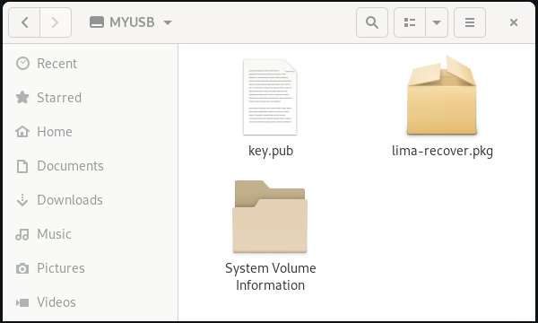

# How to get root access to Lima Ultra

## Disclaimer

This procedure is designed to give you root access to the Linux running on Lima Ultra. It is designed for people comfortable with technical matters. Errors or issues during the procedure may brick the device. There is absolutely no warranty whatsoever regarding its result.

*Very few people have tested this procedure for now, you may want to wait a little before doing so.*

## Prerequisites

You will need:

- A Lima Ultra whose firmware has been updated since June 2017. This cannot work with devices straight out of the factory.

- A USB mass storage device (e.g. a USB key) formatted in FAT32.

- A SSH RSA public key (*not* Ed25519) whose private key you control.

- A way to figure out the IP address of your device, such as access to your router's admin interface.

## Step 1: prepare the USB key

- Format your USB key with a FAT32 filesystem.
- Copy the file [`lima-recover.pkg`](lima-recover.pkg) (SHA256: `f565055fb70f9430218924d33976d8436e163907eb6dbdde6e7deee0cdd3b3b5`) to the root of the USB key.
- Copy your SSH public key to the root of the USB key alsongside the previous file. The file containing the key must be named `key.pub`.

At this point the contents of your USB key should look like this:

## Step 2: root the device

Make sure to follow these steps precisely. I suggest you watch [this video](https://www.youtube.com/watch?v=h3I6vh8tHyc) before attempting the procedure.

- Unplug the power cable from your Lima Ultra.
- Plug the USB key into the Lima Ultra's USB port.
- Press the button below the Lima Ultra and *do not release it* until told to.
- Plug the power cable back into the Lima Ultra. The LED should blink with a specific pattern, then turn plain blue for a while, the turn off.
- When the LED has turned off, you may release the button. Wait until the LED turns back on.
- Once the LED has turned back on, you may unplug the USB key and power cycle the Lima Ultra device. Wait until the LED comes back out, it should behave as usual i.e. blink slowly for a while then turn off.

## Step 3: check everything worked correctly

Plug the USB key back into your PC. At the root of the key there should be a text file called `root-state.txt` and whose contents should be `DONE`. If the file is not there, or if you see something else inside, the procedure failed.

## Step 4: SSH into your Lima

You must now find the local IP address of your Lima device. Lima uses DHCP to get its IP address, so the easiest way to find it is to look in your router's admin interface. Look for a device called something like `Lima-0XXXX` (where `0XXXX` is the end of your device's serial number), or whose MAC address starts with `80:0E:24`.

Supposing the IP address of the device is `192.168.1.10` for instance, run:

    ssh root@192.168.1.10

You may have to specify your private key explicitly, like this:

    ssh -i ~/.ssh/my-private-key root@192.168.1.10

If everything went OK, you should now be logged in as root into your Lima Ultra device!
